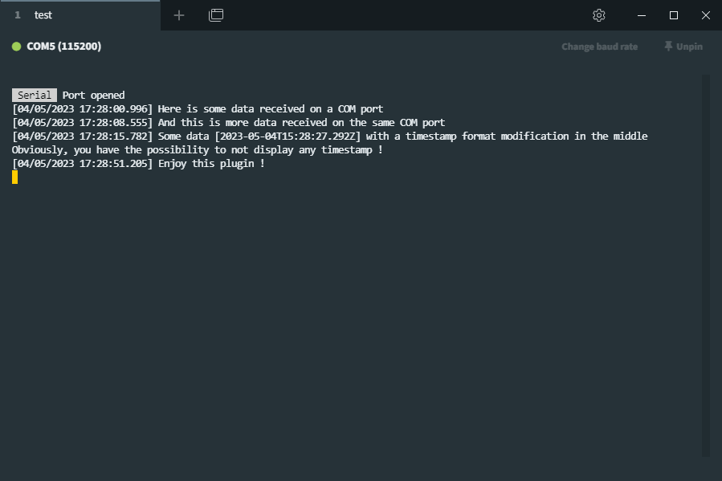

# Serial Timestamp 

## What is Serial-Timestamp for Tabby ?

This plugin adds timestamp to a serial tab using:

- Terminal decorators
- Config file options
- Setting tabs

## Changelog
- **v1.0.3**:
    - Correct issue where date was not being prepended with timestamp for data arriving after a CR not followed by a LF
- **v1.0.2**:
    - Complete refactor of the timestamp mechanism. Before the timestamp was added after a line-feed. This was causing data not arriving immediately after the last line to be improperly timestamped
- **v1.0.1**:
    - Correct issue where timestamped month is not the current month
    - Force to display day, month, hours, minutes and seconds on 2 digits
    - Force to display milliseconds on 3 digits
- **v1.0.0**:
        Initial release